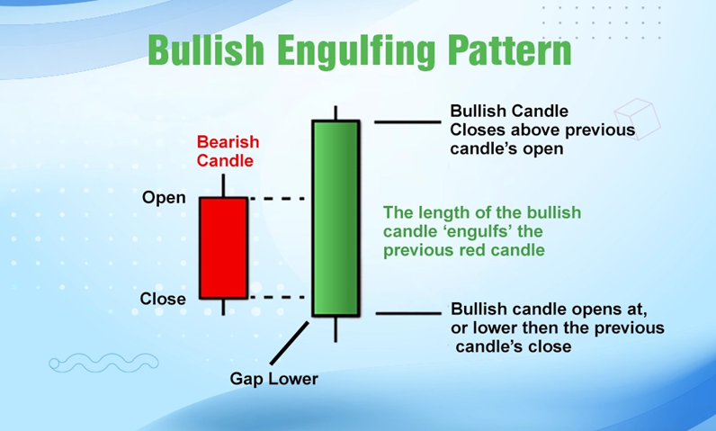

# nifty-engulfing-detect
This project implements a **real-time scanner** that detects the **Bullish Engulfing candlestick pattern** on **Nifty 50 stocks** using Zerodha's Kite Connect API.

The goal is to assist in identifying intraday or multi-timeframe (MTF) trade triggers. Currently, signals are logged for manual execution, with plans for future automation once MTF support is provided by Kite Connect.

---

## What is a Bullish Engulfing Pattern?

A **Bullish Engulfing** pattern is a two-candle reversal signal that typically appears after a downtrend:
- The first candle is bearish (red).
- The second candle is bullish (green) and **completely engulfs** the body of the previous candle.

It suggests a potential shift in momentum from sellers to buyers.

### 📊 Diagram



_Source: trudedata.in_

---

## Features

- Real-time detection of Bullish Engulfing patterns
- Periodic scanning of Nifty stocks
- Updates signals to an Excel file
- Threaded execution for non-blocking data fetch
- Manual trade trigger support (future-ready for auto-execution)

---

## Tech Stack

| Component        | Purpose                                |
|------------------|----------------------------------------|
| `kiteconnect`    | Fetch real-time data via Zerodha API   |
| `pandas`         | Data manipulation                      |
| `datetime`       | Time-based logic                       |
| `threading`      | Periodic scanning in the background    |
| `os`             | File management (Excel updates)        |

---
## Project Structure

```bash
nifty-engulfing-detect/
├── mtf_trading_paper.py     # Main script for detection
├── kiteGetAccessToken.py    # Kite access token generation
├── kiteSettings.py          # Kite API dependencies
├── MTF_Trading.xlsx         # Excel output file (updated live)
└── README.md

## Note on Usage
You will need API credentials from Kite Connect to use this tool.
Ensure compliance with Zerodha’s API rate limits and terms of use.
Currently built for manual analysis, but designed for easy automation in the future.


## Disclaimer
This is a personal research project intended for educational and testing purposes.
It does not constitute trading advice, and I take no responsibility for any financial outcomes.

